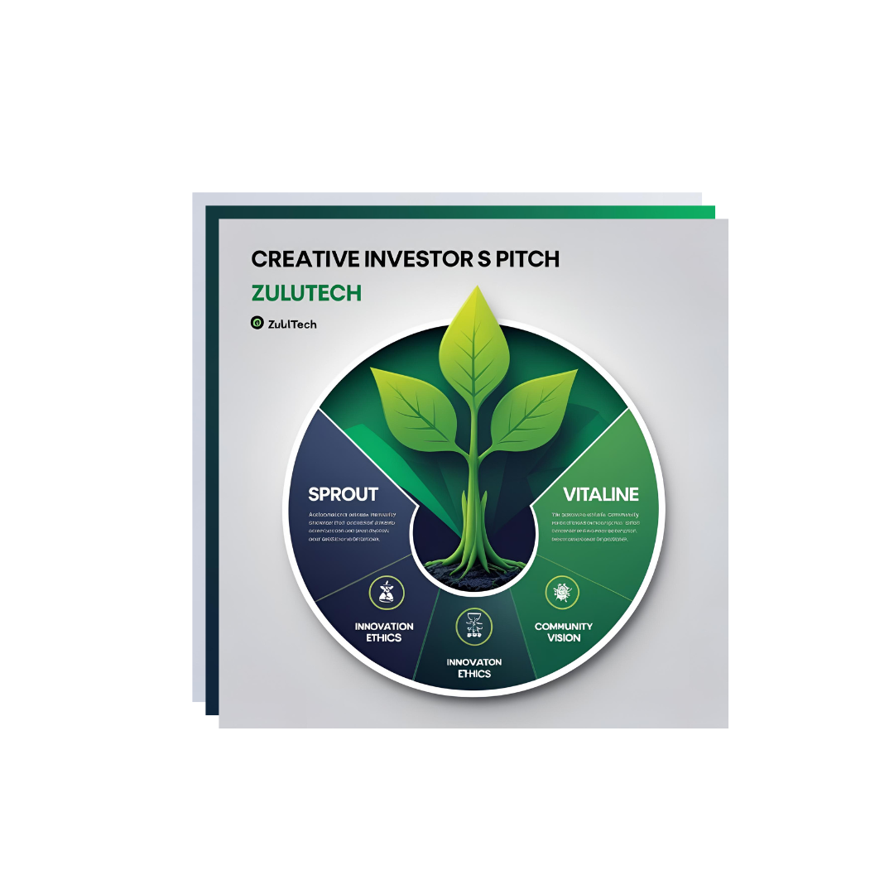
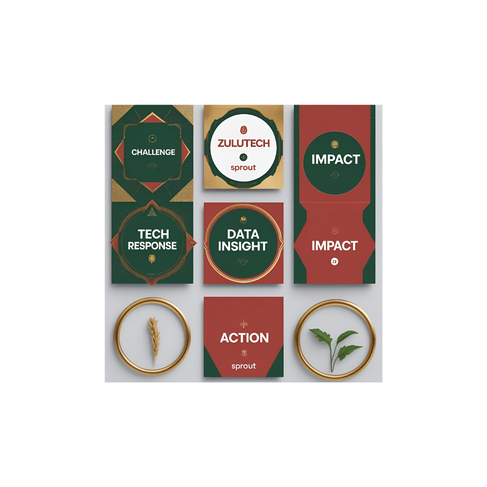

# 🌿 ZuluTech Brand Kit

**Empowering African agro-innovation through visual storytelling and ethical design.**  
This repository hosts the official branding assets, strategy documents, and carousel content for the ZuluTech Social Growth project—curated by the NeoBrand Surge studio.

---

## 🔍 Overview

ZuluTech merges smart farming with community-led storytelling.  
This brand kit documents the social media materials, captions, and strategic assets behind our campaign launch.

---

## 📂 Repository Contents

| File/Folder                            | Description                                           |
|---------------------------------------|-------------------------------------------------------|
| `zulutech-carousel-captions.md`       | 5-slide caption set for Instagram carousel            |
| `ZuluTech_Social_Captions.pdf`        | Exported PDF version for pitch decks & archiving      |
| `logo.png` / `pitch-cover.png`        | Visual assets for branding use                        |
| `BrandingAndEthicalTech.md`           | ZuluTech's voice philosophy and ethical intentions    |
| `social-carousel.png`                 | Preview of carousel layout (Magic Media or Canva)     |

---

## 🎯 Vision & Voice

ZuluTech believes in:
- 📈 Data-driven community growth  
- 🌾 Farming innovation rooted in local identity  
- 🧠 Storytelling that uplifts and activates

All visual assets are designed in the **Afro-futurist tech aesthetic** with Pan-African color schemes and ethical overlays.

---

## 🖼️ Visual Previews

### 🔗 Investor Pitch Slide  
Strategic intro slide with sprout icon and value pillars  

### 📲 Carousel Preview  
Swipeable social series built to convert — highlights Challenge ➡️ Tech ➡️ Data ➡️ Impact ➡️ Action  

🔗 Full captions → [zulutech-carousel-captions.md](./zulutech-carousel-captions.md)

## 📲 Social Launch Strategy

This kit supports:
- Instagram carousel launch
- Threads/LinkedIn teaser campaigns
- PDF archiving for investors & collaborators

Next steps: [EduLegacy](https://github.com/) and [NeoFinTech Spark](https://github.com/) brand kits coming soon.

---

## 🛠 Maintained By

🧑‍💻 [Leonard Phokane](https://github.com/leonardphokane) — Flutter dev, branding strategist, and legacy storyteller.

For inquiries: [email or link here]

---

## 🌍 License

Assets are published under [choose license type]  
Usage with attribution encouraged for non-commercial educational or outreach purposes.

